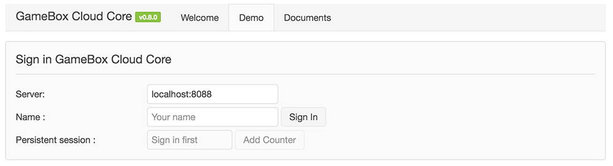
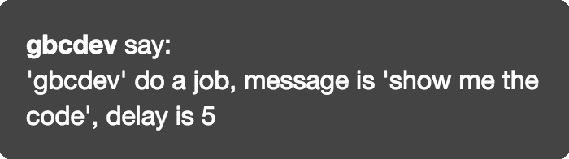

# 快速开始

GameBox Cloud（后文简称 GBC）为开发者提供一个稳定可靠，可伸缩的服务端架构，让开发者可以使用 Lua 脚本语言快速完成服务端的功能开发。

让我们跟随本文的指引，开始 GBC 之旅吧！


## 运行 Demo

1.  首先是 [安装并启动 GBC](install.md)，完成这一步以后，我们先打开浏览器，访问 `http://localhost:8088`，应该可以 GBC 的欢迎页面。

2.  点击页面上部的 **Demo**，将进入 GBC 的一个测试页面：

    

3.  在这里输入一个用户名，然后点击 "Sign In" 就可以登录到服务器。登录后即可使用各种测试。


在这个 **Demo** 测试中，可以用到的功能有：

-   Session：点击用户名下方的 **Add Counter** 按钮可以看到数值不断增加。这个数值就是存储在服务端的 Session 里。

-   发送消息给用户：可以多开几个页面，访问 `http://localhost:8088` 页面并以不同用户名登录。这样在 **Online Users** 里可以看到所有已经登录的用户。选择任意用户，输入内容，并点击 **Send** 按钮即可将消息发给指定用户。点击 **Send All** 可以把消息发给所有登录的用户。

    

-   定时发消息：选择等待时间，输入消息内容，点击 **Send to Job** 即可添加一个延时任务。在指定的时间到达后，会在页面上看到之前输入的消息。

    


## 运行单元测试

GBC 附带了一组单元测试。这组单元测试既是用于 GBC 开发阶段的功能验证和错误检查，也可以作为学习 GBC 用法的参考。

要运行单元测试，在命令行下进入安装好的 GBC 目录，执行：

```bash
$ cd /opt/gbc-core
$ ./apps/tests/shells/run_tests
```

将看到类似如下输出：

```
## Test Case : beanstalkd
[SERVER beanstalkd.basics] ok
[CLI    beanstalkd.basics] ok
[SERVER beanstalkd.tube] ok
[CLI    beanstalkd.tube] ok

## Test Case : components
[SERVER components.binding] ok
[CLI    components.binding] ok

## Test Case : jobs
[SERVER jobs.add] ok
[CLI    jobs.add] ok
```

单元测试的主要代码都在 `./apps/tests/actions` 和 `./apps/jobs` 目录中。可以在线查看最新源代码：[https://github.com/dualface/gbc-core/tree/develop/apps/tests](https://github.com/dualface/gbc-core/tree/develop/apps/tests)。


## 创建自己的 Hello 应用

试过了 Demo 和单元测试，下面就开始创建我们的第一个 `Hello` 应用吧。

首先创建应用的目录，例如 `hello`，并在其中建立以下目录和文件：

```
+-- hello/
  +-- conf/
  | \-- app_entry.conf
  |
  +-- actions/
    \-- HelloAction.lua
```

两个文件的内容分别是：

**`conf/app_entry.conf`**

```
location /hello/ {
    content_by_lua 'nginxBootstrap:runapp("_APP_ROOT_")';
}
```

这里务必注意写成 `/hello/`，而不是 `/hello`。如果没有后面的 `/`，那么访问时会出错。

**`actions/HelloAction.lua`**

```lua
local gbc = cc.import("#gbc")
local HelloAction = cc.class("HelloAction", gbc.ActionBase)

function HelloAction:sayAction(args)
    local word = args.word or "world"
    return {result = "hello, " .. word}
end

return HelloAction
```

添加完文件后，还需要修改 GBC 安装目录里的 `conf/config.lua` 文件。

`conf/config.lua` 文件中定义了所有需要加载的应用的路径：

```lua
-- all apps
apps = {
    welcome = "_GBC_CORE_ROOT_/apps/welcome",
    tests   = "_GBC_CORE_ROOT_/apps/tests",
},
```

我们现在将我们的应用加入其中：

```lua
-- all apps
apps = {
    welcome = "_GBC_CORE_ROOT_/apps/welcome",
    tests   = "_GBC_CORE_ROOT_/apps/tests",
    hello   = "/home/duck/hello",
},
```

注意这里的 `/home/duck/hello` 是 app 的绝对路径，根据实际路径填写。

完成修改后，必须重启 GBC：

```bash
./stop_server && sleep 2
./start_server --debug && sleep 2
./check_server
```

启动完成后应该看到：

```
worker-hello:00                  STARTING
worker-hello:01                  STARTING
```

表示我们的 `hello` 已经正常启动了。

现在来测试一下：

```bash
curl -o - "http://localhost:8088/hello/?action=hello.say"

{"result":"hello, world"}


curl -o - "http://localhost:8088/hello/?action=hello.say&word=code"

{"result":"hello, code"}
```

记得之前 `app_entry.conf` 里 `/hello/` 的写法吗，所以这里也应该用 `/hello/?action=` 的写法。

试着修改一下 `HelloAction.lua`，然后测试看看结果是否会有不同。

要添加更多接口到 `Hello` 应用中，请参考[编码规范](coding-style.md)。

<br />

### 参考

-   [安装并启动 GBC](install.md)
-   [编码规范](coding-style.md)
-   [配置文件](configs.md)
